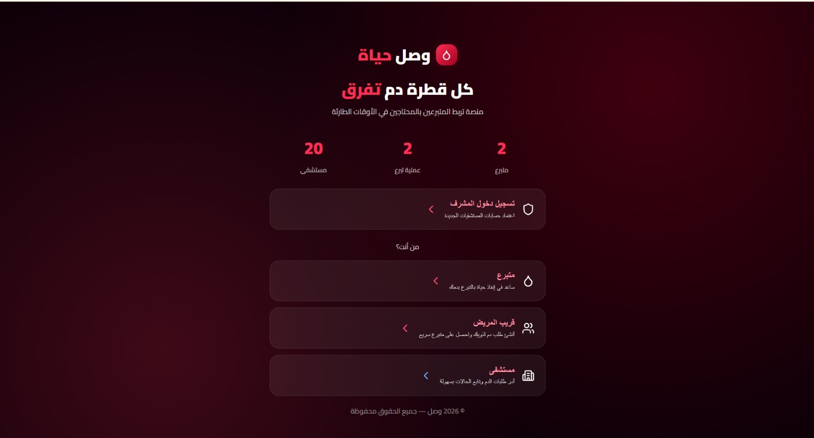
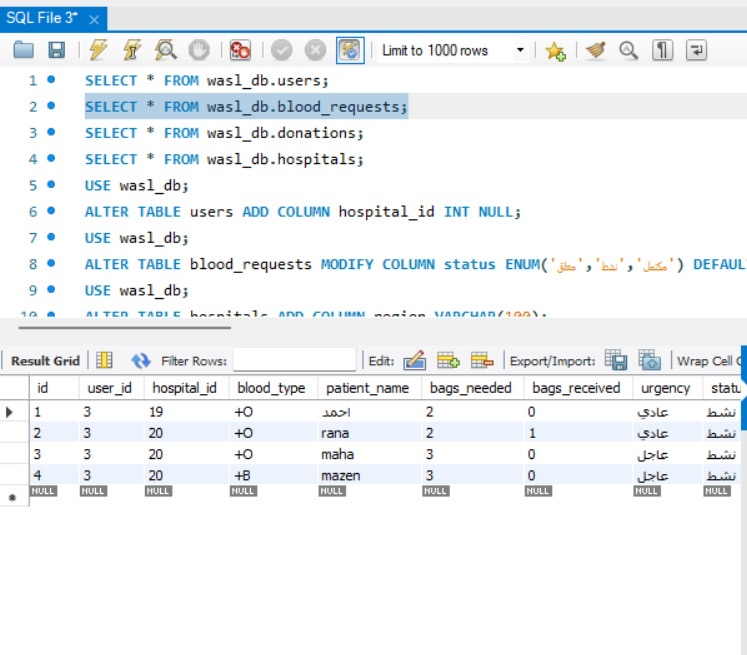

# Stage 1 Report

## Team Formation and Idea Development

## 1. Team Formation Overview

At the beginning of the project, our team held a meeting to introduce ourselves and discuss our skills, interests, and what roles we prefer to take in the project. After the discussion, we decided to divide the responsibilities based on what each team member is most comfortable with.

### Team Members and Roles

| Name                 | Role               | Responsibilities                                                                 |
| -------------------- | ------------------ | -------------------------------------------------------------------------------- |
| Ahmed Khaled AlOmani | UI/UX Designer     | Designing the interface layout and making sure the application is easy to use    |
| Amjad Khalid AlOmani | Database Engineer  | Designing and managing the database structure                                    |
| Lamis Fahad Aljabli   | Frontend Developer | Building the user interface and connecting it with the backend                   |
| Raneem Tarik Alsaqat | Backend Developer  | Implementing the application logic and connecting the frontend with the database |

### Collaboration Strategy

To communicate and organize our work, we decided to use **Discord** as our main communication platform. We will use it to discuss ideas, share updates, and coordinate tasks.

We also plan to divide tasks clearly between team members and hold regular discussions to make sure everyone is aligned and aware of the project progress.

---

# 2. Research and Brainstorming

During the brainstorming stage, we discussed several possible project ideas. Our goal was to find an idea that solves a real problem and is still possible to implement within the time of the project.

### Idea 1: Food Donation Platform

This idea was about creating a platform that connects restaurants or individuals with charities so they can donate leftover food instead of wasting it.

**Strengths**

* Helps reduce food waste
* Supports people who need food

**Weaknesses**

* Requires coordination with restaurants and charities
* Logistics such as transportation could make it complicated

**Reason for Rejection**

Even though the idea is useful, it requires real-world logistics and partnerships, which might be difficult to manage in a student project.

---

### Idea 2: Hospital Appointment Booking System

Another idea was creating a system where users can book hospital appointments online.

**Strengths**

* Useful for patients
* Easy to understand concept

**Weaknesses**

* Already exists in many healthcare applications
* Not very innovative

**Reason for Rejection**

We decided not to choose this idea because similar systems already exist, so it would not be very unique.

---

# 3. Idea Evaluation

To choose the best idea, we evaluated each option based on several criteria:

* **Feasibility** – whether the project can be completed within the available time
* **Impact** – how helpful the solution is for users
* **Technical Fit** – how well it matches our current technical skills
* **Innovation** – whether the idea is creative and unique

After discussing these points, we selected the idea that seemed both impactful and realistic for our team to implement.

---

# 4. Selected MVP Concept

## Project Name

**Wasl (وصل)**

### Summary

Wasl is a platform that connects blood donors with patients or hospitals that need blood donations. The goal of the platform is to make it easier to find donors when a specific blood type is needed urgently.

Users can register as donors and add their blood type. When there is a request for a certain blood type, the system can identify suitable donors and send them notifications.

### Problem

Hospitals sometimes urgently need a specific blood type, but it can be difficult to quickly find available donors. This delay may affect patients who need blood transfusions.

### Proposed Solution

The Wasl platform helps solve this problem by creating a system where donors can register and store their blood type information. Hospitals or patients can search for donors with matching blood types, and in emergency cases, the platform can notify donors who match the request.

### Target Users

The platform is mainly intended for:

* Blood donors
* Hospitals
* Patients who need blood donations

---

# 5. Key MVP Features

For the first version of the project (MVP), we plan to include the following features:

* Donor registration system
* Storing blood type information
* Searching donors by blood type
* Sending emergency notifications to matching donors

These features represent the core functionality needed to demonstrate the main idea of the project.

---

# 6. Potential Challenges

Some challenges we identified include:

* Making sure donor information is accurate
* Handling emergency notifications efficiently
* Encouraging people to register as donors

---

# 7. Opportunities

This platform could have several positive impacts:

* Helping hospitals find blood donors faster
* Supporting patients who need urgent blood donations
* Encouraging community participation in blood donation

---

# 8. Reason for Selecting This Idea

We selected the Wasl platform because it solves a real problem and has a meaningful social impact. It is also technically possible to build within the timeframe of the project and fits well with the skills of our team members.

# Stage 2: Project Charter

## 1. Project Objectives

### Purpose
The purpose of this project is to develop a mobile application (Wasl) that connects patients, hospitals, and blood donors efficiently to support emergency blood donation and help save lives.

### SMART Objectives
- Enable patients or hospitals to submit a blood request within less than 2 minutes.
- Allow donors to find and respond to matching blood donation cases based on blood type.
- Notify relevant donors within a short time after an emergency request is created.

---

## 2. Stakeholders and Roles

### Stakeholders

**Internal Stakeholders**
- Project Team (developers & designer)

**External Stakeholders**
- Patients (request blood)
- Hospitals (manage and monitor requests)
- Donors (respond to donation requests)
- Instructor (evaluation and guidance)

### Team Roles

| Name | Role | Responsibilities |
|----------------------|--------------------|------------------|
| Ahmed Khaled Al-Omani | UI/UX Designer | Design user interface and improve user experience |
| Amjad Khalid Al-Omani | Database Engineer | Design and manage database |
| Lamis Fahad Aljabli | Frontend Developer | Build UI and connect to backend |
| Raneem Tarik Alsaqat | Backend Developer | Implement logic and APIs |

---

## 3. Scope

### In-Scope
- User registration (Donor / Patient / Hospital)
- Blood request creation
- Search by blood type
- Emergency notifications
- Basic user profiles

### Out-of-Scope
- Payment systems
- Integration with real hospital systems
- Advanced medical records
- Real-time GPS tracking (for MVP stage)

---

## 4. Risks and Mitigation

| Risk | Mitigation |
|------|-----------|
| Lack of experience with tools | Learn early using tutorials and practice |
| Time constraints | Divide tasks and set clear deadlines |
| Technical bugs | Test frequently during development |
| Poor communication | Hold weekly meetings and use Discord |

---

## 5. High-Level Plan

| Stage | Tasks | Timeline |
|------|------|----------|
| Stage 1 | Idea Development | Completed |
| Stage 2 | Project Charter | Completed |
| Stage 3 | Technical Documentation | Week 3–4 |
|  | - Design ERD (database structure) | |
|  | - Define system architecture | |
|  | - Prepare API endpoints | |
| Stage 4 | MVP Development | Week 5–8 |
|  | - Backend development (API implementation) | |
|  | - Frontend development (UI screens) | |
|  | - Database integration | |
| Stage 5 | Testing & Final Delivery | Week 9–10 |
|  | - System testing | |
|  | - Bug fixing | |
|  | - Final presentation | |

## Stage 3 — User Stories & Mockups
 
### MoSCoW Priority Key
 
| Label | Meaning |
|-------|---------|
| `Must Have` | Core — MVP cannot ship without this |
| `Should Have` | Important but can be deferred |
| `Could Have` | Nice-to-have, raises project quality |
| `Won't Have` | Out of scope for MVP |
 
---
 
### 👤 User 1 — Patient Family (Blood Requester)
 
| Priority | User Story |
|----------|------------|
| `Must Have` | As a patient family member, I want to create a blood donation request with blood type, bag count, hospital, and urgency level, so that I can reach matching donors quickly. |
| `Must Have` | As a patient family member, I want to set the urgency level (normal / urgent), so that critical cases are handled with priority. |
| `Must Have` | As a patient family member, I want to track my request status in real time, so that I know how many donors have responded and how many bags are still needed. |
| `Must Have` | As a patient family member, I want to receive a notification when a donor accepts or the request is fulfilled, so that I am immediately informed. |
| `Should Have` | As a patient family member, I want to edit or cancel an active request, so that I can update the information if the situation changes. |
| `Could Have` | As a patient family member, I want to share the request via WhatsApp, so that I can reach donors outside the app. |
| `Could Have` | As a patient family member, I want to view my past requests, so that I can track the patient's donation history. |
 
---
 
### 🏥 User 2 — Hospital
 
| Priority | User Story |
|----------|------------|
| `Must Have` | As a hospital, I want to register an official account with name, location, and contact info, so that I can manage blood donation cases reliably. |
| `Must Have` | As a hospital, I want to view all active blood requests with blood type, status, and donor count, so that I can monitor and coordinate responses. |
| `Must Have` | As a hospital, I want to confirm a donation was completed, so that the case status updates automatically for all users. |
| `Must Have` | As a hospital, I want to accept, close, or update cases, so that I have full control over each request's lifecycle. |
| `Should Have` | As a hospital, I want to view full case details including patient name and donor list, so that I can manage the medical file accurately. |
| `Could Have` | As a hospital, I want a statistics dashboard showing donation counts and most-requested blood types, so that I can plan proactively. |
 
---
 
### 🩸 User 3 — Donor
 
| Priority | User Story |
|----------|------------|
| `Must Have` | As a donor, I want to register with my blood type and city, so that the system can match me to nearby relevant cases. |
| `Must Have` | As a donor, I want to browse available blood cases with blood type, hospital, and distance, so that I can choose the most suitable case. |
| `Must Have` | As a donor, I want to press "I want to donate" on a case, so that the hospital is notified of my intent. |
| `Must Have` | As a donor, I want to receive an instant notification when a case matching my blood type is posted, so that I can respond quickly. |
| `Should Have` | As a donor, I want to filter cases by blood type or city, so that I only see relevant cases. |
| `Should Have` | As a donor, I want to view my donation history, so that I can track my contributions over time. |
| `Could Have` | As a donor, I want to earn points for every donation, so that I feel appreciated and stay motivated. |
| `Won't Have` | As a donor, I want to receive payment for donating — *out of scope (fully voluntary platform)*. |
 
---
 
### Priority Summary
 
| Priority | Feature | User |
|----------|---------|------|
| `Must Have` | Create blood request + set urgency | Patient Family |
| `Must Have` | Track request progress in real time | Patient Family |
| `Must Have` | Notifications (donor accepted / case complete) | Patient Family + Donor |
| `Must Have` | Hospital account registration | Hospital |
| `Must Have` | View & manage cases + confirm donation | Hospital |
| `Must Have` | Donor registration with blood type | Donor |
| `Must Have` | Browse cases + donate button | Donor |
| `Must Have` | Real-time notifications for matching cases | Donor |
| `Should Have` | Edit / cancel request | Patient Family |
| `Should Have` | Full case details | Hospital |
| `Should Have` | Filter cases + donation history | Donor |
| `Could Have` | Share request via WhatsApp | Patient Family |
| `Could Have` | Statistics dashboard | Hospital |
| `Could Have` | Points system | Donor |
| `Won't Have` | Payment for donation | All |
 
---
 
### Mockups
 
Three main screens were designed for the MVP:
 
- **Donor Home** — Case cards with blood type badge, progress bar, urgency tag, distance, and donate button
- **Patient Family — New Request Form** — Blood type grid selector, bag count, hospital name, contact number, urgency toggle
- **Hospital Dashboard** — Stats grid (active cases, monthly donations, most-requested type, completion rate) + case list with confirm button
> Interactive prototype available in `/prototype/wasal_app.html`
 
---
 
*Wasl — Connecting donors with those who need them most.*
---

## Stage 3 — System Architecture

The Wasl system follows a client-server architecture designed for real-time interaction between users (donors, patient families, and hospitals).

The mobile application (front-end) is developed using React Native and serves as the interface for all users. It communicates with the back-end through RESTful API requests.

The back-end is built using Node.js and Express, which handles business logic such as creating blood requests, matching donors, managing case status, and sending notifications.

A centralized database (MySQL) stores all system data, including users, blood requests, and donations.

Firebase Cloud Messaging (FCM) is used as an external service to deliver real-time notifications to donors when a matching case is created and to update patients on request progress.

Data flows as follows:  
Users interact with the mobile app → requests are sent to the back-end → data is processed and stored in the database → notifications are triggered via Firebase → updates are reflected back in the app in real time.

The architecture ensures scalability, fast response time, and reliable communication between all system components.
---

## Stage 3 — API Specifications

The Wasl system exposes a set of RESTful API endpoints to handle user actions such as creating requests, donating, and managing cases.

---

### 🔐 Auth Endpoints

#### POST /api/auth/register

Registers a new user (donor, patient family, or hospital)

**Request Body:**

```json
{
  "name": "Lamis",
  "email": "Lamis@email.com",
  "password": "123456",
  "role": "donor",
  "blood_type": "A+",
  "city": "Riyadh"
}
```

**Response:**

```json
{
  "message": "User registered successfully"
}
```

---

#### POST /api/auth/login

**Request Body:**

```json
{
  "email": "Lamis@email.com",
  "password": "123456"
}
```

**Response:**

```json
{
  "token": "JWT_TOKEN"
}
```

---

### 🩸 Request Endpoints

#### POST /api/requests

Create a new blood request

**Request Body:**

```json
{
  "patient_name": "Ahmed",
  "blood_type": "O+",
  "bags_needed": 3,
  "city": "Riyadh",
  "urgency": "urgent"
}
```

**Response:**

```json
{
  "message": "Request created",
  "request_id": 101
}
```

---

#### GET /api/requests

Get all active requests

**Response:**

```json
[
  {
    "id": 101,
    "blood_type": "O+",
    "bags_needed": 3,
    "donated_count": 1,
    "status": "active"
  }
]
```

---

### 🤝 Donation Endpoints

#### POST /api/donations

Donor volunteers to donate

**Request Body:**

```json
{
  "request_id": 101
}
```

**Response:**

```json
{
  "message": "Donation registered"
}
```

---

#### PATCH /api/donations/:id/confirm

Hospital confirms donation

**Response:**

```json
{
  "message": "Donation confirmed, case updated"
}
```

## SCM and QA Plans

### Source Control Management (SCM)

The project uses Git and GitHub for version control and collaboration.

- Each team member works on a separate branch to avoid conflicts
- Changes are merged into the main branch using pull requests
- Code is reviewed before merging to ensure quality
- Clear and meaningful commit messages are used to track progress

This approach helps maintain organized development and prevents code conflicts.

---

### Quality Assurance (QA)

To ensure system reliability and correctness, several testing methods are applied:

- Unit Testing: Testing individual functions and components
- Integration Testing: Ensuring the frontend, backend, and database work together correctly
- Manual Testing: Verifying complete user flows such as creating requests and responding as a donor
- Bug Tracking: Identifying and fixing issues during development

Regular testing ensures the system works as expected and improves overall quality.

---

## Technical Justifications

The following technologies were selected based on project requirements:

- React Native: Allows building a cross-platform mobile application efficiently
- Python (Flask or Django): Provides a reliable and scalable backend for handling APIs, business logic, authentication, and request management.
- MySQL: Suitable for structured relational data such as users, requests, and donations
- Firebase Cloud Messaging (FCM): Enables real-time push notifications for emergency cases

These technologies were chosen because they are reliable, widely used, and suitable for building scalable real-time applications like Wasl.

---

## Attached Diagrams and Supporting Files

For easier navigation and evaluation, all required technical diagrams and supporting files are included in the project repository root directory:

- **System Architecture Diagram:** [arch_diagram.JPG](./arch_diagram.JPG)
- **Data Flow Diagram:** [dataflow_diagram.png](./dataflow_diagram.png)
- **UML / Class Diagram:** [wasal_uml_1.png](./wasal_uml_1.png)
- **Entity Relationship Diagram (ERD):** [wasl_erd.jpeg](./wasal_erd.png)
- **Sequence Diagram 1 — Patient Family Posts Request:** [seq1_post_request_3.PNG](./seq1_post_request_3.PNG)
- **Sequence Diagram 2 — Donor Responds to Request:** [seq2_donor_donates_3.jpeg](./seq2_donor_donates_3.jpeg)
- **Sequence Diagram 3 — Hospital Confirms Donation:** [sequence diagram3.jpeg](./sequence_diagram3.jpeg)

These files provide complete visual documentation for system structure, workflow, and database design as required for Stage 3.


<!-- ===================== Stage 4 ===================== -->
<!-- Sprint Planning & Development Execution -->

# Stage 4 — Sprint Planning & Development Execution

## 1. Sprint Planning (Task 0)

<!-- We divided the work into two main sprints -->

To manage development effectively, the team divided the MVP work into two main sprints.

### Sprint Duration

- Each sprint duration: **2 weeks**

---

### Sprint 1 — Core Backend & Database

<!-- Focus on backend + database -->

**Goal:** Prepare backend structure and database design

| Task | Priority | Assigned To |
|------|----------|------------|
| Design database schema (ERD) | Must Have | Database Engineer |
| Setup backend project (Flask) | Must Have | Backend Developer |
| Implement authentication APIs | Must Have | Backend Developer |
| Define API endpoints | Must Have | Backend Developer |
| API Testing | Should Have | QA |

---

### Sprint 2 — Frontend & Integration

<!-- Focus on UI + integration -->

**Goal:** Prepare UI and system integration

| Task | Priority | Assigned To |
|------|----------|------------|
| Design UI mockups | Must Have | UI/UX |
| Build React structure | Must Have | Frontend |
| Connect frontend to APIs | Should Have | Frontend + Backend |
| Notification logic | Should Have | Backend |
| Integration testing | Should Have | QA |

---

### Task Prioritization

<!-- Using MoSCoW -->

The team used the **MoSCoW method**:

- **Must Have:** Registration, requests, donations
- **Should Have:** Filters, notifications
- **Could Have:** Extra features

---

## 2. Development Execution (Task 1)

<!-- Initial implementation -->

During this stage, the team focused on **initial implementation and setup**.

### Work Completed

- Flask backend project initialized
- React frontend initialized
- MySQL database schema designed
- Initial API routes created
- Authentication structure prepared
- UI mockups created
- Manual functionality testing performed

---

### Source Control (SCM)

<!-- Git workflow -->

- GitHub repository created
- Feature branching strategy applied
- Pull request workflow defined

---

### Quality Assurance (QA)

<!-- Testing plan -->

- Manual testing strategy defined
- Manual functionality testing
- Integration testing plan prepared

---

### ⚠️ Execution Status

<!-- Important clarification -->

Due to time constraints:

- Full implementation was **partially completed**
- However, **core setup, architecture, and planning were successfully achieved**

---

## 3. Monitoring Progress (Task 2)

<!-- Tracking progress -->

To monitor project progress, the team conducted regular meetings and reviewed development tasks throughout the sprint.

### Metrics Used

- Completion of planned features
- Progress against sprint objectives
- Resolution of identified issues
- Team feedback and meeting discussions

### Adjustments

Based on meeting feedback, several improvements and feature changes were identified:

- Improved email validation in registration
- Replaced region input with a dropdown list
- Added email notification requirements
- Enhanced UI/UX design and responsiveness
- Improved filtering experience with loading animations
- Added hospital verification requirements
- Clarified donation restrictions and user guidance

---

## 4. Sprint Reviews & Retrospectives (Task 3)

<!-- Review + reflection -->

### Sprint Reviews

#### Meeting 1

Features and improvements discussed:

- Add hospitals to the system
- Implement donor points and rewards
- Automatically close fulfilled requests
- Add notification functionality

#### Meeting 2

No formal meeting notes were recorded.

#### Meeting 3

Requested improvements:

- Improve email validation in Sign Up
- Replace region text field with a dropdown list
- Display requests based on hospital city
- Send email notifications when hospitals approve requests
- Improve overall UI design

#### Meeting 4

Development feedback and enhancements:

- Keep users logged in after backend integration
- Expand page layouts
- Move navigation tabs to a side menu
- Improve text readability using black font color
- Add loading animations during filtering
- Enable email notifications
- Implement routing and footer
- Hide patient names and display hospital and location only
- Store authentication tokens
- Clarify donation limitations for users
- Improve UI/UX clarity
- Design a project logo
- Improve mobile responsiveness
- Disable blood type editing after registration

#### Meeting 5

Additional requirements:

- Improve labels in patient request forms
- Send notifications after donation confirmation
- Perform Gorilla Testing
- Add an Admin page for hospital verification

---

### Sprint Retrospective

#### What Went Well

- Effective collaboration among team members
- Successful frontend and backend initialization
- Database design completed successfully
- Continuous feedback helped refine requirements

#### Challenges

- Limited development time
- Frontend-backend integration complexity
- Additional effort required for notification features
- Several UI improvements identified during development

#### Improvements for Future Iterations

- Begin implementation earlier
- Allocate more time for integration testing
- Finalize UI requirements before development
- Increase testing coverage before deployment

---

## 5. Integration & QA Testing (Task 4)

<!-- Testing phase -->

### Testing Performed

The system was tested manually throughout development.

Testing included:

- Registration functionality
- Login functionality
- Search and filtering features
- User interface validation
- Database record verification

### Testing Evidence & Results

The following screenshots provide evidence of testing and implementation.

#### Home Page

> Add screenshot here:

```text
evidence/homepage.png
```



#### Registration Page

> Add screenshot here:

```text
evidence/register.png
```


#### Login Page

> Add screenshot here:

```text
evidence/login.png
```


#### Search and Filter Functionality

> Add screenshot here:

```text
evidence/filter.png
```


#### Database Verification

> Add screenshot here:

```text
evidence/database.png
```



### Not Fully Completed

- Full production deployment
- Advanced automated testing
- Complete notification integration

---

## 6. Deliverables (Task 5)

<!-- Final outputs -->

- ✅ Sprint Planning Documentation
- ✅ GitHub Repository
- ✅ Database Schema (ERD)
- ✅ API Design
- ✅ Frontend & Backend Setup
- ✅ SCM Strategy
- ✅ QA Plan

---

## 7. Final Summary

<!-- Conclusion -->

The project successfully achieved:

- Agile sprint planning
- Clear task distribution
- System architecture design
- Backend and frontend initialization
- Database design
- Development workflow (SCM and QA)

Although the MVP was not fully implemented, the team demonstrated a strong planning process and technical foundation.

---

## 8. Project Resources

### Sprint Planning

Sprint planning activities are documented in Section 1 of this README.

### Source Repository

- [GitHub Repository](https://github.com/Raneemts/wasl)

### Bug Tracking

Issues and bugs were identified during meetings, development activities, and testing sessions, then resolved through collaborative development and GitHub commits.

### Testing Evidence & Results

Testing screenshots are available in the `evidence` folder.

### Production Environment

The application currently runs in a local development environment using:

- React (Frontend)
- Flask (Backend)
- MySQL (Database)

The system has not yet been deployed to a public production server.
