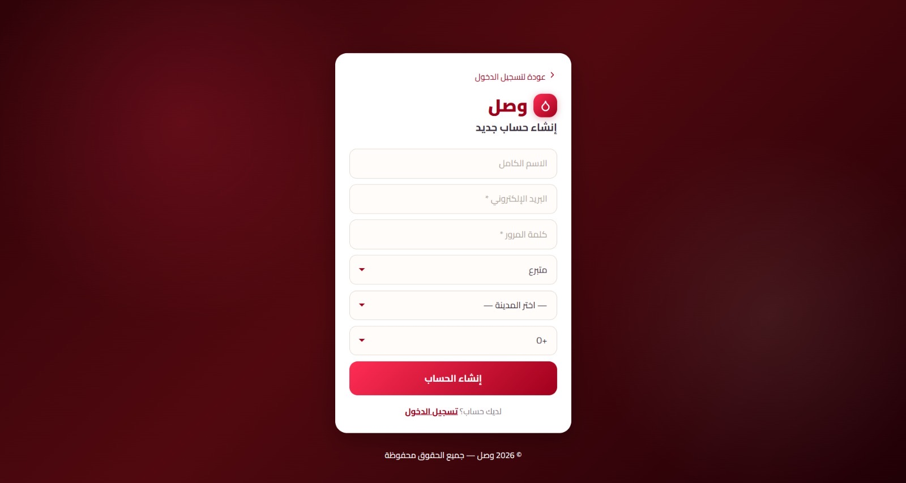
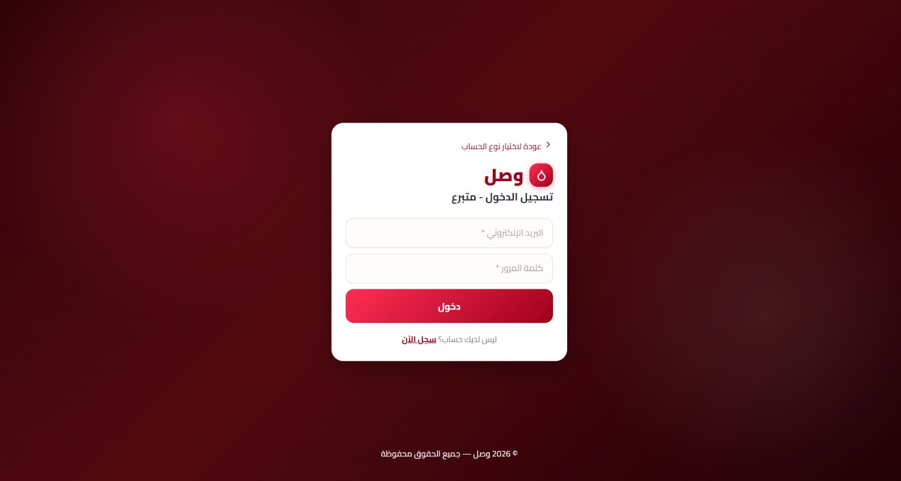
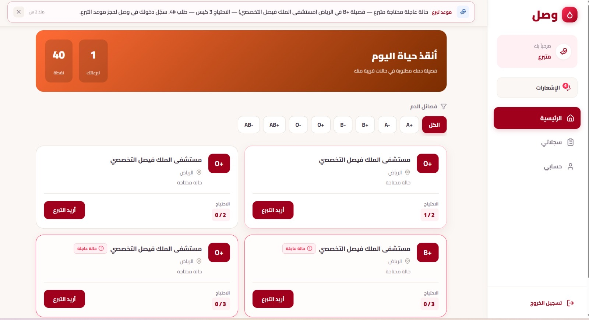
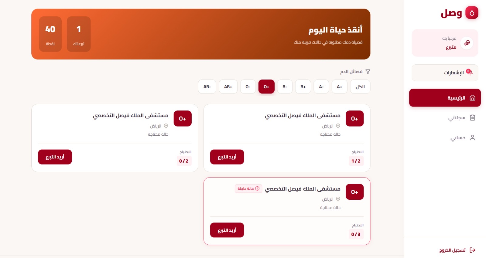

<!-- ===================== Stage 4 ===================== -->
<!-- Sprint Planning & Development Execution -->

# Stage 4 — Sprint Planning & Development Execution

## 1. Sprint Planning (Task 0)

<!-- We divided the work into two main sprints -->

To manage development effectively, the team divided the MVP work into two main sprints.

### Sprint Duration

- Each sprint duration: **2 weeks**

---

### Sprint 1 — Core Backend & Database

<!-- Focus on backend + database -->

**Goal:** Prepare backend structure and database design

| Task | Priority | Assigned To |
|------|----------|------------|
| Design database schema (ERD) | Must Have | Database Engineer |
| Setup backend project (Flask) | Must Have | Backend Developer |
| Implement authentication APIs | Must Have | Backend Developer |
| Define API endpoints | Must Have | Backend Developer |
| API Testing | Should Have | QA |

---

### Sprint 2 — Frontend & Integration

<!-- Focus on UI + integration -->

**Goal:** Prepare UI and system integration

| Task | Priority | Assigned To |
|------|----------|------------|
| Design UI mockups | Must Have | UI/UX |
| Build React structure | Must Have | Frontend |
| Connect frontend to APIs | Should Have | Frontend + Backend |
| Notification logic | Should Have | Backend |
| Integration testing | Should Have | QA |

---

### Task Prioritization

<!-- Using MoSCoW -->

The team used the **MoSCoW method**:

- **Must Have:** Registration, requests, donations
- **Should Have:** Filters, notifications
- **Could Have:** Extra features

---

## 2. Development Execution (Task 1)

<!-- Initial implementation -->

During this stage, the team focused on **initial implementation and setup**.

### Work Completed

- Flask backend project initialized
- React frontend initialized
- MySQL database schema designed
- Initial API routes created
- Authentication structure prepared
- UI mockups created
- Manual functionality testing performed

---

### Source Control (SCM)

<!-- Git workflow -->

- GitHub repository created
- Feature branching strategy applied
- Pull request workflow defined

---

### Quality Assurance (QA)

<!-- Testing plan -->

- Manual testing strategy defined
- Manual functionality testing
- Integration testing plan prepared

---

### ⚠️ Execution Status

<!-- Important clarification -->

Due to time constraints:

- Full implementation was **partially completed**
- However, **core setup, architecture, and planning were successfully achieved**

---

## 3. Monitoring Progress (Task 2)

<!-- Tracking progress -->

To monitor project progress, the team conducted regular meetings and reviewed development tasks throughout the sprint.

### Metrics Used

- Completion of planned features
- Progress against sprint objectives
- Resolution of identified issues
- Team feedback and meeting discussions

### Adjustments

Based on meeting feedback, several improvements and feature changes were identified:

- Improved email validation in registration
- Replaced region input with a dropdown list
- Added email notification requirements
- Enhanced UI/UX design and responsiveness
- Improved filtering experience with loading animations
- Added hospital verification requirements
- Clarified donation restrictions and user guidance

---

## 4. Sprint Reviews & Retrospectives (Task 3)

<!-- Review + reflection -->

### Sprint Reviews

#### Meeting 1

Features and improvements discussed:

- Add hospitals to the system
- Implement donor points and rewards
- Automatically close fulfilled requests
- Add notification functionality

#### Meeting 2

No formal meeting notes were recorded.

#### Meeting 3

Requested improvements:

- Improve email validation in Sign Up
- Replace region text field with a dropdown list
- Display requests based on hospital city
- Send email notifications when hospitals approve requests
- Improve overall UI design

#### Meeting 4

Development feedback and enhancements:

- Keep users logged in after backend integration
- Expand page layouts
- Move navigation tabs to a side menu
- Improve text readability using black font color
- Add loading animations during filtering
- Enable email notifications
- Implement routing and footer
- Hide patient names and display hospital and location only
- Store authentication tokens
- Clarify donation limitations for users
- Improve UI/UX clarity
- Design a project logo
- Improve mobile responsiveness
- Disable blood type editing after registration

#### Meeting 5

Additional requirements:

- Improve labels in patient request forms
- Send notifications after donation confirmation
- Perform Gorilla Testing
- Add an Admin page for hospital verification

---

### Sprint Retrospective

#### What Went Well

- Effective collaboration among team members
- Successful frontend and backend initialization
- Database design completed successfully
- Continuous feedback helped refine requirements

#### Challenges

- Limited development time
- Frontend-backend integration complexity
- Additional effort required for notification features
- Several UI improvements identified during development

#### Improvements for Future Iterations

- Begin implementation earlier
- Allocate more time for integration testing
- Finalize UI requirements before development
- Increase testing coverage before deployment

---

## 5. Integration & QA Testing (Task 4)

<!-- Testing phase -->

### Testing Performed

The system was tested manually throughout development.

Testing included:

- Registration functionality
- Login functionality
- Search and filtering features
- User interface validation
- Database record verification

### Testing Evidence & Results

The following screenshots provide evidence of testing and implementation.

#### Home Page

#### Registration Page

#### Login Page

#### Donor Dashboard

#### Search and Filter Functionality

#### Database Verification

### Not Fully Completed

- Full production deployment
- Advanced automated testing
- Complete notification integration

---

## 6. Deliverables (Task 5)

<!-- Final outputs -->

- ✅ Sprint Planning Documentation
- ✅ GitHub Repository
- ✅ Database Schema (ERD)
- ✅ API Design
- ✅ Frontend & Backend Setup
- ✅ SCM Strategy
- ✅ QA Plan

---

## 7. Final Summary

<!-- Conclusion -->

The project successfully achieved:

- Agile sprint planning
- Clear task distribution
- System architecture design
- Backend and frontend initialization
- Database design
- Development workflow (SCM and QA)

Although the MVP was not fully implemented, the team demonstrated a strong planning process and technical foundation.

---

## 8. Project Resources

### Sprint Planning

Sprint planning activities are documented in Section 1 of this README.

### Source Repository

- [GitHub Repository](https://github.com/Raneemts/wasl)

### Bug Tracking

Issues and bugs were tracked during development meetings and testing sessions. Identified issues were resolved through team collaboration and updates pushed to GitHub repository

### Testing Evidence & Results

Testing screenshots are available in the `evidence` folder.

### Production Environment

The application currently runs in a local development environment using:

- React (Frontend)
- Flask (Backend)
- MySQL (Database)

The system has not yet been deployed to a public production server.
